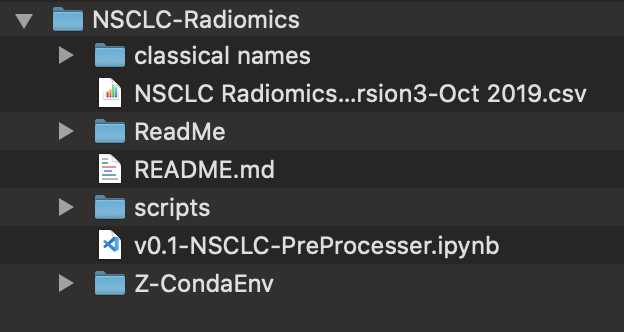

# NSCLC-Radiomics
The repo where I keep my project for NSCLC-Radiomics data analytics. You can find a history of this readme file at ReadMe/Z-readme_archive

# Current Organization
v0.1 is now posted. You can open the notebook and follow the steps. Name: `v0.1-NSCLC-PreProcesser.ipynb`

You should note that the notebook assumes you have downloaded NSCLC data (classical nameing) and have it on the same directory as the root of the repository. 




## Instructions
The notebook has been written with full documentation. You can review the steps of the code there. 

My tool set does not include anything fancy, but for eas of use I have added my Conda env file. 
You can clone my environment with command:
```
conda env create -f ./Z-CondaEnv/ims_mini_project_env.yml
```

You can also add the environment to your IPython kernels with
```
python -m ipykernel install --user --name=ims_mini_project
```

## Technologies
Python is the main tool that I have utlized for this project. You can find the environment file in **Z-Conda-Env** and replicated my environment. 

# Code Overview
Full code overview is available in v0.1 notebook
